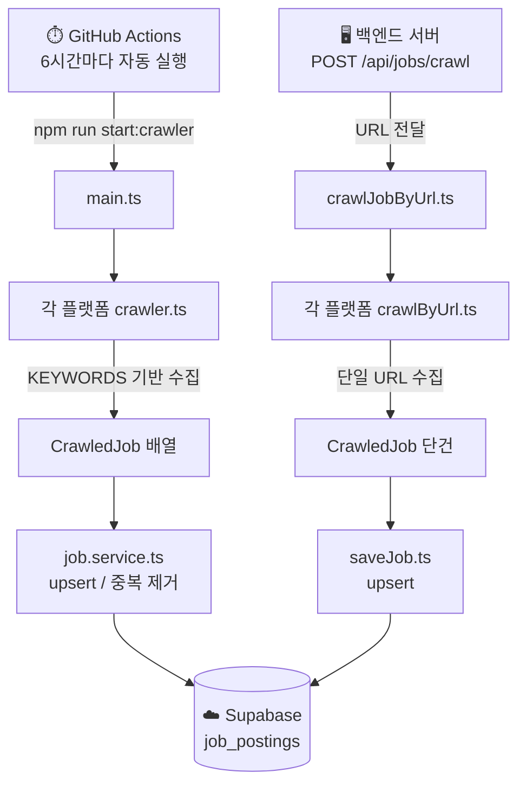

# 🕷️ Job Crawler

채용 사이트에서 공고를 자동으로 수집하여 Supabase DB에 저장하는 크롤링 서비스입니다.
배치 자동 크롤링, 단일 URL 수동 크롤링, 어드민 대시보드를 제공합니다.

---

## 📌 지원 플랫폼

| 플랫폼             | 방식            | 단일 URL 지원 |
| ------------------ | --------------- | :-----------: |
| 원티드 (Wanted)    | API             |      ✅       |
| 사람인 (Saramin)   | HTML 파싱       |      ✅       |
| 인크루트 (Incruit) | HTML 파싱       |      ✅       |
| 점핏 (Jumpit)      | API + HTML 파싱 |      ✅       |

---

## 🛠 기술 스택

- **Runtime** : Node.js
- **Language** : TypeScript
- **DB** : Supabase (PostgreSQL)
- **HTTP** : Axios
- **HTML 파싱** : Cheerio
- **서버** : Express
- **스케줄링** : GitHub Actions

---

## 📁 프로젝트 구조

```
job-crawler/
├── .github/
│   └── workflows/
│       └── crawler.yml         # GitHub Actions 자동 스케줄링
├── src/
│   ├── config/
│   │   └── keywords.ts         # 크롤링 키워드 설정
│   ├── controllers/
│   │   └── adminController.ts  # 어드민 API 핸들러
│   ├── crawler/
│   │   ├── wanted/
│   │   │   ├── crawler.ts          # 원티드 배치 크롤러
│   │   │   └── crawlWantedByUrl.ts # 원티드 단일 URL 크롤러
│   │   ├── saramin/
│   │   │   ├── crawler.ts
│   │   │   └── crawlSaraminByUrl.ts
│   │   ├── incruit/
│   │   │   ├── crawler.ts
│   │   │   └── crawlIncruitByUrl.ts
│   │   ├── jumpit/
│   │   │   ├── crawler.ts
│   │   │   └── crawlJumpitByUrl.ts
│   │   ├── crawlJobByUrl.ts    # URL로 플랫폼 감지 후 크롤링
│   │   └── main.ts             # 배치 크롤링 진입점
│   ├── public/
│   │   └── admin.html          # 어드민 대시보드 UI
│   ├── routes/
│   │   ├── admin.ts            # 어드민 라우트
│   │   └── job.ts              # 공고 API 라우트
│   ├── services/
│   │   ├── job.service.ts      # DB upsert / 중복 제거
│   │   └── saveJob.ts          # 단일 공고 저장
│   ├── utils/
│   │   ├── dateParser.ts       # 마감일 파싱
│   │   ├── detectPlatform.ts   # URL로 플랫폼 감지
│   │   ├── extractExternalId.ts
│   │   └── mapper.ts           # CrawledJob → DB 형식 변환
│   └── server.ts               # Express 서버 진입점
├── supabase.ts                 # Supabase 클라이언트
├── types.ts                    # 공통 타입 정의
└── package.json
```

---

## 🔄 데이터 흐름



---

## ⚙️ 환경 변수

프로젝트 루트에 `.env` 파일을 생성하세요.

```env
SUPABASE_PROJECT_URL=your_supabase_url
SUPABASE_SERVICE_ROLE_API_KEY=your_service_role_key
```

> GitHub Actions 자동 실행을 위해 Repository Secrets에도 동일하게 등록해야 합니다.  
> `Settings → Secrets and variables → Actions`

---

## 🚀 실행 방법

```bash
# 의존성 설치
npm install

# API 서버 실행 (수동 크롤링 + 어드민 페이지)
npm run dev:api

# 배치 크롤러 직접 실행
npm run dev:crawler

# 빌드
npm run build

# 빌드 후 서버 실행 (운영)
npm run start

# 빌드 후 배치 크롤러 실행 (운영)
npm run start:crawler
```

---

## 🔑 키워드 설정

배치 크롤링 시 사용할 키워드는 `src/config/keywords.ts`에서 관리합니다.

```typescript
export const KEYWORDS = [
  "프론트",
  "보안",
  // 원하는 키워드 추가 후 커밋하면 다음 배치부터 반영됩니다
];
```

---

## 📡 API

### `POST /api/jobs/crawl` — 단일 URL 크롤링 + DB 저장

백엔드 서버에서 호출하는 수동 크롤링 엔드포인트입니다.

**Request Body**

```json
{
  "url": "https://공고링크"
}
```

**Response**

```json
{
  "success": true,
  "data": { "...저장된 공고 데이터" }
}
```

**지원 URL 형식**

| 플랫폼   | URL 형식                                                         |
| -------- | ---------------------------------------------------------------- |
| 원티드   | `https://www.wanted.co.kr/wd/{id}`                               |
| 사람인   | `https://www.saramin.co.kr/zf_user/jobs/relay/view?rec_idx={id}` |
| 인크루트 | `https://job.incruit.com/jobdb_info/jobpost.asp?job={id}`        |
| 점핏     | `https://www.jumpit.co.kr/position/{id}`                         |

---

## 🖥️ 어드민 페이지

서버 실행 후 브라우저에서 접속합니다.

```
http://localhost:3000/admin
```

### 크롤링 테스트 탭

- 소스(`wanted` / `saramin` / `incruit` / `jumpit` / `all`) 선택 후 실행
- **DB 저장 없이** 수집 결과만 확인
- 수집 건수, 키워드별 통계, 빈 필드 현황 표시
- 전체 공고 테이블 (빈 필드 빨간색 하이라이트)
- 필터: 전체 / 빈 필드 있음 / 자격요건 없음 / 마감일 없음

### 단일 URL 테스트 탭

- 특정 채용공고 URL 입력 후 크롤링 결과 즉시 확인
- **DB 저장 없음**
- 각 필드별 수집 결과 표시

### DB 현황 탭

- 전체 자동 수집 공고 수
- 소스별 공고 수
- 날짜별 수집 현황 (최근 30일)
- DB 필드 품질 현황 (누락 건수)

---

## ⏱️ 자동 스케줄링

GitHub Actions로 **6시간마다** 자동 배치 크롤링이 실행됩니다.

| 항목      | 내용                               |
| --------- | ---------------------------------- |
| 실행 주기 | 매 6시간 (`0 */6 * * *`)           |
| 수동 실행 | GitHub Actions 탭 → `Run workflow` |
| Node 버전 | 22                                 |
| 설정 파일 | `.github/workflows/crawler.yml`    |

---

## 🗃️ 데이터 구조

### CrawledJob

```typescript
type CrawledJob = {
  externalId: string; // 각 플랫폼의 고유 ID
  title: string; // 직무명
  company: string; // 회사명
  companyLogo?: string; // 회사 로고 URL
  location: string; // 근무지
  experience: string; // 경력 요건
  deadline: string; // 마감일
  url: string; // 공고 원문 URL
  requirements?: string; // 자격요건
  preferred?: string; // 우대사항
  content?: string; // 직무 내용
  keyword: string; // 매칭된 키워드
};
```

### DB 중복 방지

`source_site_name + external_id` 조합으로 `upsert`하여 동일 공고의 중복 저장을 방지합니다.
